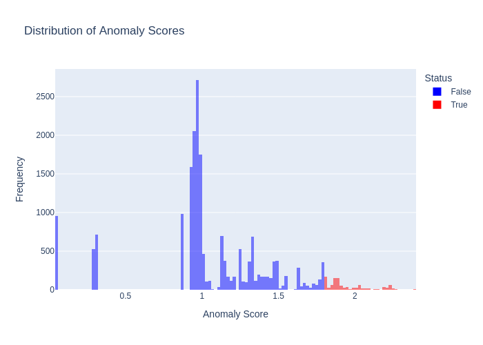
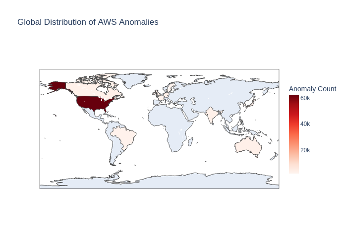
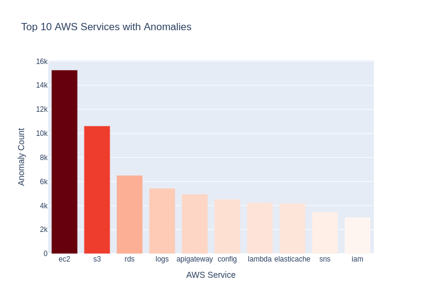

# AWS CloudTrail Anomaly Detection: Machine Learning with PySpark

## Executive Summary
This project implements an automated threat detection pipeline designed to identify anomalous user behavior and operational irregularities within AWS CloudTrail logs. By leveraging **PySpark** for big data processing and **KMeans Clustering** for unsupervised machine learning, the solution analyzes over **1.9 million log records** to flag potential security breaches, misconfigurations, or policy violations that static rule-based alerts often miss.

The primary objective was to move beyond signature-based detection and utilize statistical deviation to identify "unknown unknowns" in cloud infrastructure usage.

## Technical Architecture & Stack
* **Data Processing:** Apache PySpark (Scalable log ingestion and transformation)
* **Machine Learning:** Spark MLlib (KMeans Clustering, Vector Assembly)
* **Visualization:** Plotly (Interactive dashboards for Security Operations)
* **Data Source:** AWS CloudTrail Logs (~2 million events)

## Methodology: From Raw Logs to Risk Signals

### 1. Feature Engineering
Raw CloudTrail logs are noisy. To prepare the data for the model, I focused on high-value features that define the "who, what, and where" of an API call:
* **Categorical Encoding:** Features such as `eventSource`, `awsRegion`, and `errorCode` were transformed using **String Indexing** and **One-Hot Encoding** to create numerical feature vectors.
* **Vector Assembly:** These processed features were consolidated into a single vector space, preparing them for high-dimensional distance calculation.

### 2. Unsupervised Anomaly Detection (KMeans)
I utilized **KMeans Clustering (k=10)** to establish a baseline of "normal" behavior. The model groups similar API activities into dense clusters.
* **Anomaly Scoring:** The score is defined as the **Euclidean distance** between a specific event and its cluster centroid.
* **Thresholding:** A threshold of **1.8** was established based on the score distribution. Any event with a distance score exceeding this limit represents a significant deviation from standard operational patterns.

## Visual Analysis & Security Insights

### Statistical Anomaly Distribution
To validate the model's thresholding logic, I analyzed the distribution of anomaly scores.

  
   
  <b>Figure 1: Distribution of Anomaly Scores</b>

The histogram above visualizes the separation between normal traffic (blue) and flagged anomalies (red). The clear "long tail" distribution confirms that the model successfully isolated rare, high-distance events—indicative of outliers—while clustering the majority of traffic as normal behavior.

### Geographical Risk Mapping
A critical indicator of compromised credentials is API activity originating from unusual geographic locations (impossible travel or geo-hopping).

  
   
  <b>Figure 2: Global Distribution of AWS Anomalies</b>

This choropleth map isolates the specific regions generating anomalous traffic. By mapping AWS regions to ISO country codes, the visualization highlights hotspots of irregular activity, allowing security teams to quickly identify if an account is being accessed from a sanctioned or unexpected country.

### Service-Level Threat Vectoring
Understanding *which* services are being targeted is essential for prioritizing incident response.

  
   
  <b>Figure 3: Top 10 AWS Services with Anomalies</b>

The analysis reveals that **EC2** and **S3** are the primary targets for anomalous activity. This high volume of anomalies in compute and storage services suggests potential data exfiltration attempts (S3) or unauthorized compute provisioning (EC2/Crypto-mining).

### Granular Event Analysis (Heatmap)
To operationalize these findings, I correlated specific API calls (`eventName`) with failure types (`errorCode`).

  
   
  <b>Figure 4: Anomaly Heatmap (Event Name vs. Error Code)</b>

This heatmap provides the "smoking gun" for investigation:
* **High-Volume Errors:** The density of `Client.InvalidSnapshot.NotFound` combined with `DescribeSnapshots` suggests automated reconnaissance scripts blindly scanning for resources that do not exist.
* **Access Denied Spikes:** The correlation between `ListClusters` and `AccessDenied` indicates a potential privilege escalation attempt where a user is probing for permissions they do not possess.

## MITRE ATT&CK Alignment
The anomalies detected by this model map directly to known adversary tactics:

| Tactic | Technique | Indicator from Model |
| :--- | :--- | :--- |
| **Discovery** | Cloud Service Discovery (T1526) | High frequency of `Describe*` and `List*` API calls flagged in the Heatmap. |
| **Credential Access** | Brute Force (T1110) | Spikes in `AccessDenied` errors across multiple services. |
| **Defense Evasion** | Unused/Unsupported Region (T1535) | Anomalous API calls originating from non-standard AWS regions (Figure 2). |

## Conclusion
This project demonstrates that **machine learning is a viable and necessary layer of defense** for cloud security. By moving beyond static thresholds, the KMeans model successfully identified nuanced attack patterns—such as reconnaissance probing and geographic anomalies—buried within millions of legitimate events. The resulting visualizations provide Security Operations Centers (SOC) with immediate, actionable intelligence to triage threats effectively.
